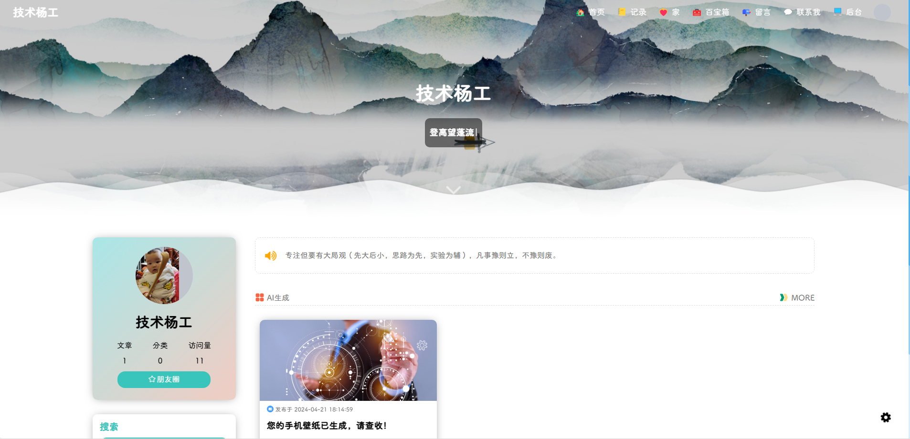
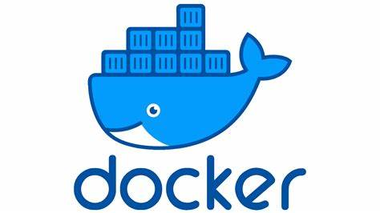

## 开源作者
[yangshare.com](https://yangshare.com)

> 这是目前我见过的，用Java写的，最好看的开源blog项目，强烈推荐大家去了解学习。
## 技术栈
前端技术：Vue2

后端技术：Java，SpringBoot，MySQL

## 网站效果

## 快速搭建

前端dockerfile: `https://gitee.com/yangshare/poetize/blob/master/liuliupi-ui/Dockerfile`

后端dockerfile: `https://gitee.com/yangshare/poetize/blob/master/liuliupi-server/poetry-web/Dockerfile`